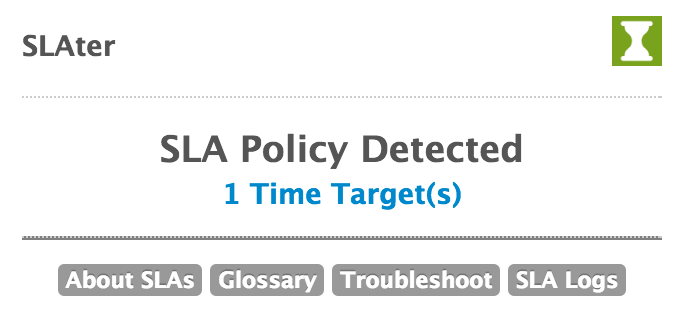
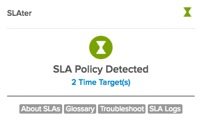
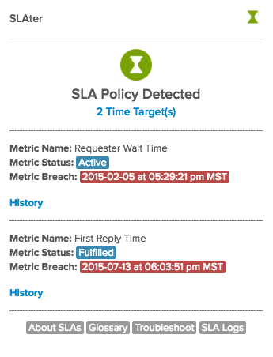
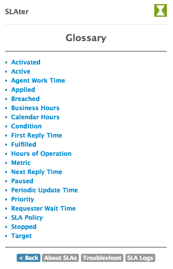
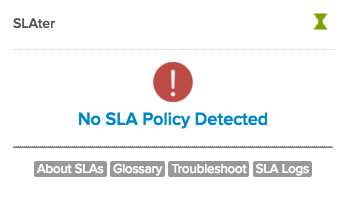
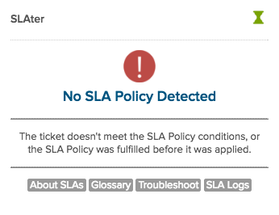
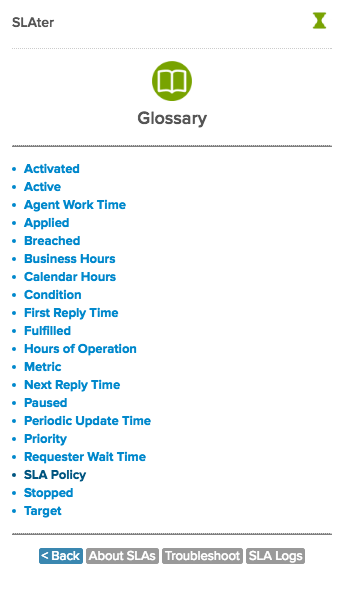

# SLAter - SLA Event Tracking App

See information about a Zendesk ticket's SLA events.

### The following information is displayed:

* Makes an API call to find important SLA data missing from the Ticket Events log.

* Displays the information for the ticket SLA events in a user-friendly manner. 

* Allows users to see when SLA metrics where applied, fulfilled, or breached.

### Screenshot(s):

